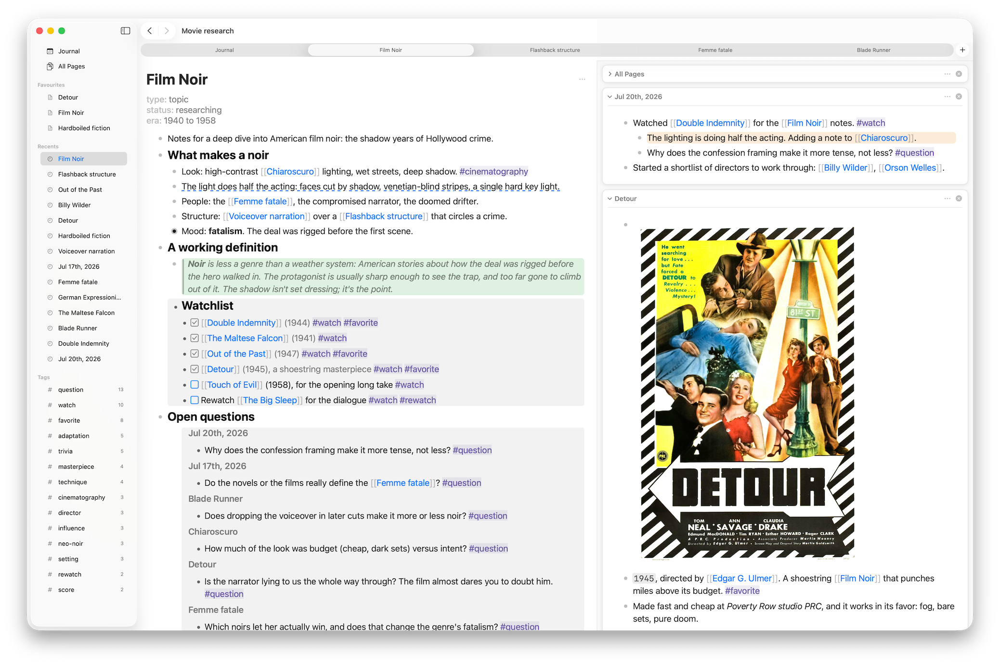

# Knopo

A native (AppKit, no Electron) macOS outliner in the Logseq tradition - your notes are blocks, pages are
trees of blocks, and everything lives as plain Markdown files you own. Local-first,
no account, no lock-in: the app is just a fast index and editor over a folder of
`.md` files. Close Knopo and your graph is still a readable, greppable, git-able
directory of Markdown.



## Features

- **Outliner editing** - every block is a node: `Enter` splits, `Tab`/`Shift+Tab`
  indent/outdent, `Alt+↑/↓` move, click a bullet to zoom in, click the triangle to
  fold. Markdown renders inline; the focused block shows raw source.
- **Plain Markdown, byte-stable** - each block maps to a line in the file, and an
  untouched block re-serializes exactly as written, so round-tripping never churns
  your files.
- **Page links `[[Page]]`** - with stub pages, link autocomplete, and graph-wide
  rename that rewrites every reference.
- **Block references & embeds** - `((block-id))` to point at a block, `{{embed …}}`
  to transclude a block or page read-only.
- **Tags `#tag`** - labels (not pages), with a generated, click-through tag view.
- **Queries `{{query …}}`** - a live, read-only result list from a small closed
  filter language: tags, page references, task state, and properties combined with
  `and` / `or` / `not`.
- **Journal** - a daily-notes home that scrolls back through previous days.
- **References** - linked and unlinked references surfaced per page.
- **Search & find** - `⌘K` full-text search across the whole graph (SQLite FTS5),
  `⌘F` find within the current view.
- **Right sidebar** - `⌘`/`Shift`-click opens pages and tag views as side-by-side
  cards for reference work.
- **Windows & tabs** - open several graphs at once, each in its own native window
  or tab (`⌘T` for a tab, **Open Graph…** to repoint one). The same graph open in
  two places stays in sync.
- **TODO / DONE** blocks and **slash commands** (`/link`, `/date`, `/embed`, …).

Some smaller touches: favourites & recents, content zoom, adjustable line spacing,
and block background colors.

See the [user guide](docs/features.md) for full documentation.

## Why it exists

There's no shortage of outliners, and several are polished Logseq clones. Knopo
exists for a different set of priorities. It's native macOS, no Electron. And it's
opinionated: it keeps Logseq's block model where that's the right idea, but it
isn't a clone and doesn't copy every Logseq decision. The bar is quality and
stability over feature count - each feature is deliberate and vetted, not added
just because another app has it.

What that looks like in practice:

- **Your files, forever** - Markdown is the source of truth and the app is
  disposable. The graph stays readable, greppable, git-friendly, and byte-stable,
  so editing never churns your files.
- **Scales without bloating** - the whole graph is never held in RAM; pages load
  on demand, so memory and startup stay flat as the graph grows.
- **Fast everything** - a rebuildable SQLite index (`.knopo/cache.db`) backs
  search, backlinks, tags, and queries, keeping navigation cheap on large graphs.
- **Native, not a browser** - AppKit and SwiftUI. Small, quick to launch, and
  edited in a real macOS text view (more below).

## What native buys you

Knopo is a real macOS app, not a wasteful Electromonster. What that gets you:

- **A real text editor** - the block you're editing is an actual macOS text view,
  so typing feels like it does everywhere else on the Mac. Web-based editors
  rebuild native behaviour by hand and rarely nail it.
- **Small and quick** - no bundled browser, so it's a few megabytes, launches
  instantly, and stays light on memory and battery for something you keep open all
  day. (To be fair, that's mostly a dig at Electron, there are leaner web shells.)
- **Fits the system** - real macOS window tabs, and dark mode, accent color, and
  accessibility settings that follow the moment you change them.

The trade-off is reach: Knopo is macOS-only, where web apps run everywhere from one
codebase.

## How it compares

|                       | Obsidian | Logseq | Roam Research | Workflowy | Craft | Knopo |
| --------------------- | :------: | :----: | :-----------: | :-------: | :---: | :-----: |
| Open source           | ✗        | ✓      | ✗             | ✗         | ✗     | ✓       |
| Native (no Electron)  | ✗        | ✗      | ✗             | ✗         | ✓     | ✓       |
| Local-first markdown  | ✓        | ✓      | ✗             | ✗         | ✗     | ✓       |
| Outliner (block tree) | ✗        | ✓      | ✓             | ✓         | ✗     | ✓       |
| Block references      | ✓        | ✓      | ✓             | ✓         | ✓     | ✓       |
| Embeds / transclusion | ✓        | ✓      | ✓             | ✓         | ✗     | ✓       |
| Queries               | ✗        | ✓      | ✓             | ✗         | ✗     | ✓       |
| Plugins               | ✓        | ✓      | ✓             | ✗         | ✓     | ✗       |

The closest neighbour is **Logseq** - same outliner model, open source, block
references, embeds, and queries - but Electron. Knopo makes the opposite platform
bet (see *What native buys you* above): native and macOS-only rather than
cross-platform.

## Status

Early but very useable. On-disk conventions may still change.

## Graph layout

A graph is a directory. Knopo lays out and maintains:

```
<graph>/
  pages/         # one Markdown file per page
  journals/      # one file per day
  assets/        # pasted/linked images and files
  .knopo/      # rebuildable cache (SQLite index, config) - safe to delete
```

The Markdown files are the source of truth; `.knopo/` is derived and can be
regenerated at any time.

## Build / test / run

A Swift Package - builds with the Command Line Tools, no Xcode required.

```sh
swift build                                    # build
./scripts/test.sh                              # run the test suite (Swift Testing)
KNOPO_GRAPH=/path/to/graph swift run Knopo # run against a graph folder
```

`KNOPO_GRAPH` defaults to `~/Documents/Knopo`; the folder is created and seeded
on first launch. To produce a double-clickable `.app`, see `scripts/build-app.sh`.

## Running a downloaded build

This app is not notarized, so macOS Gatekeeper blocks a *downloaded* copy on first
launch. To run it, either:

- strip the quarantine flag - `xattr -dr com.apple.quarantine /path/to/Knopo.app`, or
- open **System Settings → Privacy & Security** and click **Open Anyway**.

On macOS 15 (Sequoia) the old Control-click → Open shortcut no longer bypasses
Gatekeeper for un-notarized apps; use one of the above.

Building from source avoids this entirely - a locally built `.app` isn't
quarantined - but needs the Swift toolchain (the Xcode Command Line Tools).
